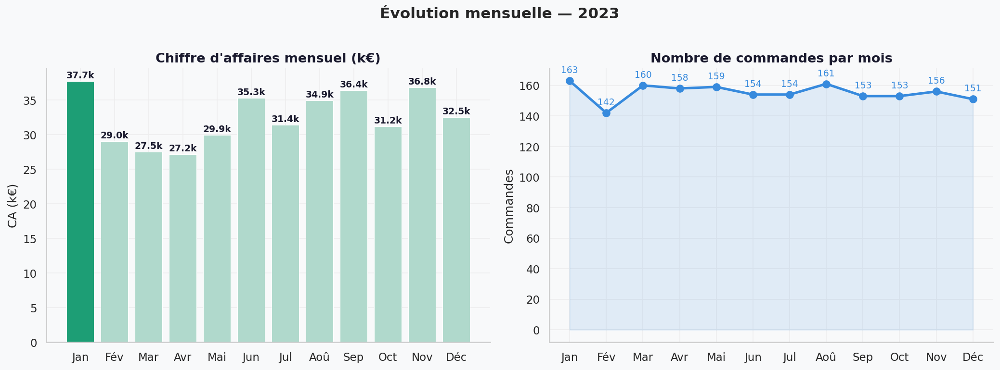
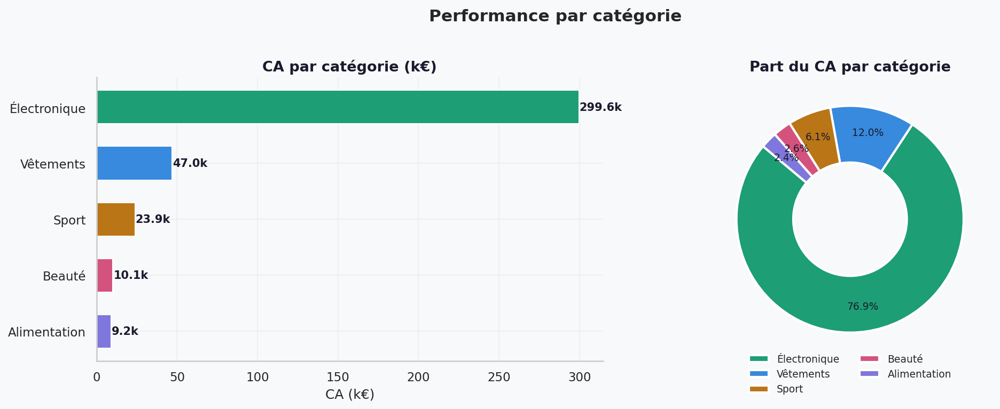
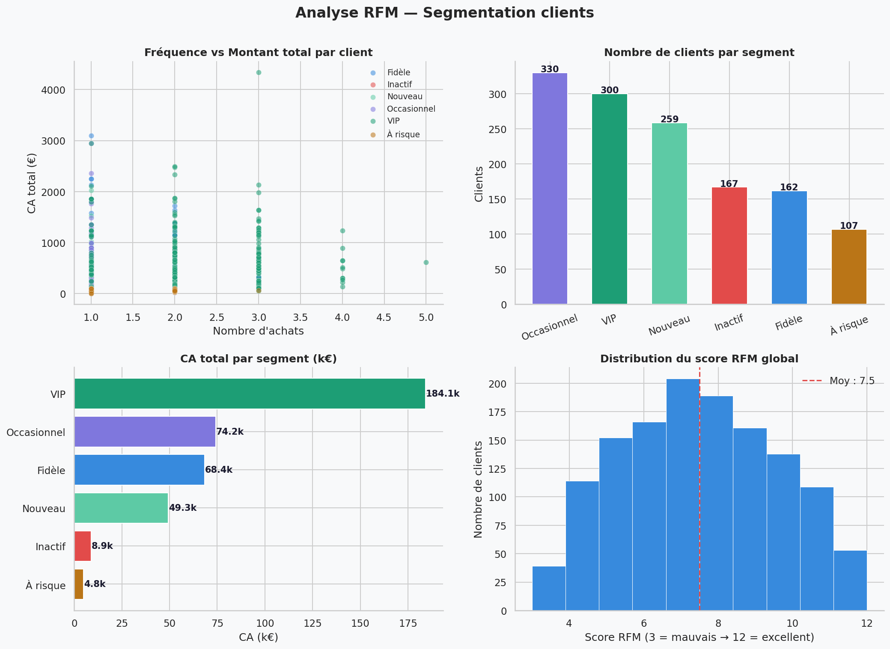

# 🛒 Analyse des Ventes E-Commerce — Projet Data Analyst

> Analyse complète d'un dataset e-commerce de 2 000 commandes sur l'année 2023.
> Ce projet démontre les compétences clés d'un Data Analyst : nettoyage,
> exploration, visualisation et segmentation client RFM.

---

## 📊 Résultats Clés

| KPI | Valeur |
|-----|--------|
| 💰 Chiffre d'affaires | ~308 000 € |
| 📦 Commandes valides | 1 864 |
| 🛒 Panier moyen | ~165 € |
| 👤 Clients uniques | 1 325 |
| 🔄 Taux de retour | 7,5 % |
| 🏆 Catégorie leader | Électronique |
| 📍 Région leader | Dakar |

---

## 🗂️ Structure du Projet

Analyse_project/
├── data/
│   ├── raw/                  # Données brutes (ne pas modifier)
│   └── processed/            # Données nettoyées et agrégées
├── src/
│   ├── generate_data.py      # Génération du dataset
│   ├── nettoyage.py          # Chargement et nettoyage
│   ├── eda_kpis.py           # Exploration et KPIs
│   ├── visualisations.py     # 7 graphiques professionnels
│   └── rfm.py                # Segmentation clients RFM
├── outputs/
│   └── figures/              # 8 graphiques PNG exportés
├── notebooks/                # Notebooks Jupyter
├── docs/                     # Documentation
├── requirements.txt
└── README.md

---

## 🔍 Analyses Réalisées

### 1. Nettoyage & Exploration (EDA)
- Vérification valeurs nulles et doublons
- Correction des types (dates, numériques)
- Séparation commandes valides / retournées

### 2. KPIs Business
- CA total, panier moyen, taux de retour
- Évolution mensuelle et trimestrielle
- Performance par catégorie et par région

### 3. Visualisations (8 graphiques)
- Évolution mensuelle du CA
- Analyse par catégorie (barres + donut)
- Top produits
- Carte géographique des ventes
- Heatmap catégorie × trimestre
- Modes de paiement
- Segmentation RFM complète

### 4. Segmentation Clients RFM
- Scoring R, F, M pour chaque client
- 6 segments : VIP, Fidèle, Nouveau, À risque, Occasionnel, Inactif
- Recommandations marketing par segment

---

## 📈 Quelques Visualisations

### Évolution mensuelle

### Analyse par catégorie

### Segmentation RFM

---

## 💡 Insights & Recommandations

1. **L'Électronique domine** avec ~66% du CA
   → Protéger cette catégorie en priorité

2. **Mobile Money est le paiement N°1** (40% des transactions)
   → Optimiser l'expérience de paiement mobile

3. **Clients à risque** détectés par le RFM
   → Campagne de réactivation urgente avec remise -15%

4. **Dakar représente 30% des ventes**
   → Fort potentiel dans les autres villes d'Afrique de l'Ouest

---

## 🛠️ Technologies

- **Python 3.10+** — Langage principal
- **Pandas** — Manipulation des données
- **NumPy** — Calculs numériques
- **Matplotlib / Seaborn** — Visualisations
- **Faker** — Génération de données réalistes

---

## 👤 Auteur

**Serigne Saliou Mbacke Thiam**

Data Analyst | Python · SQL · Visualisation

Boite mail : thiamserignesaliou@gmail.com

---
*Projet - 2026*

